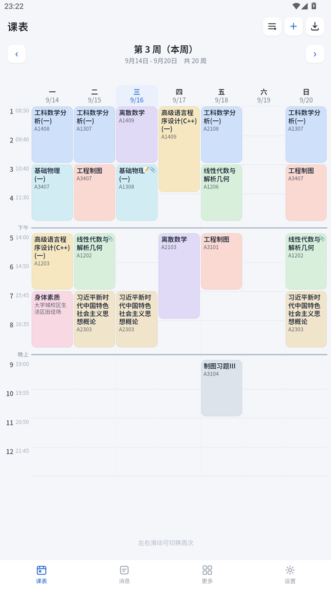
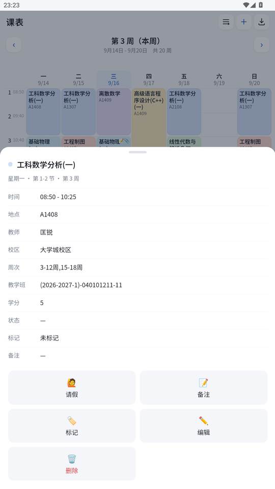
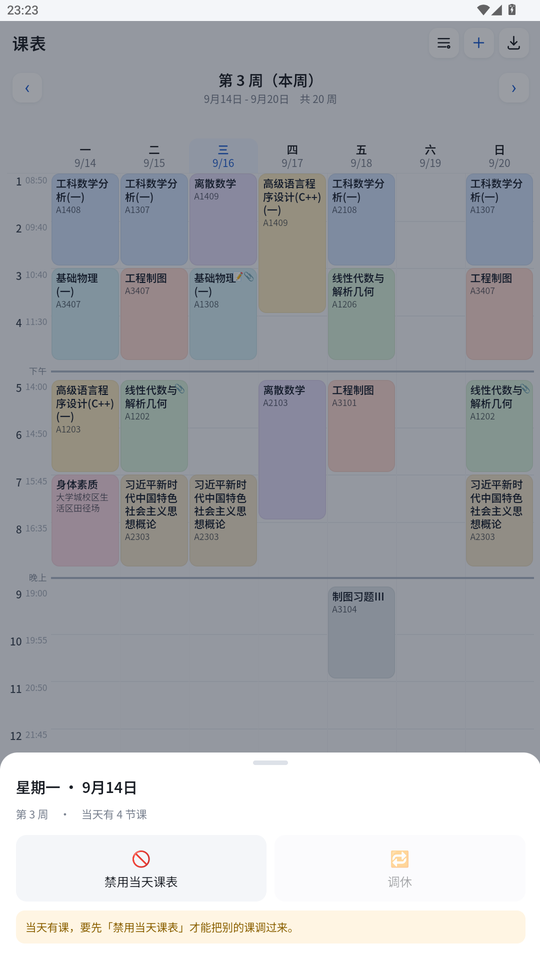
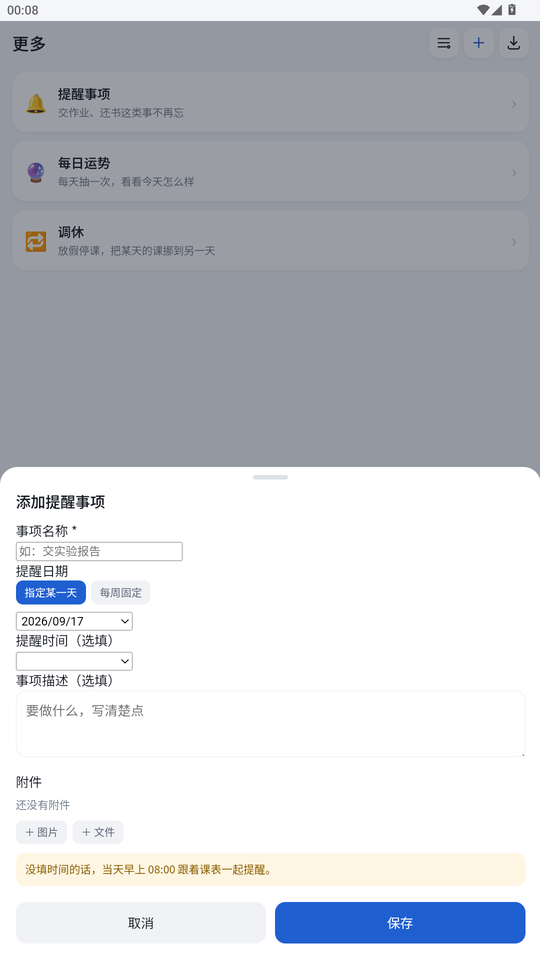
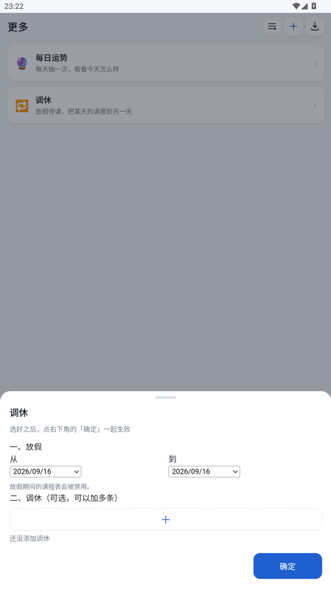
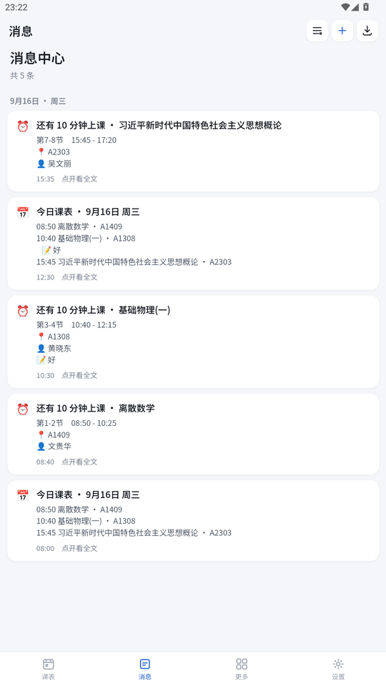
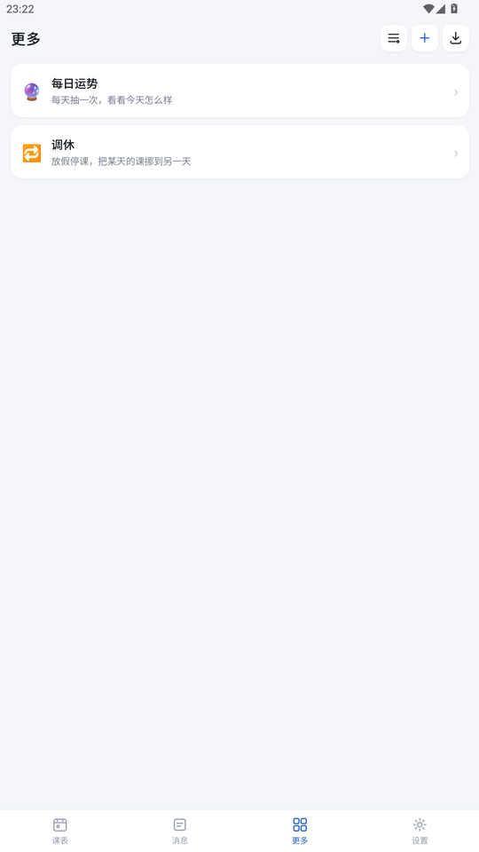
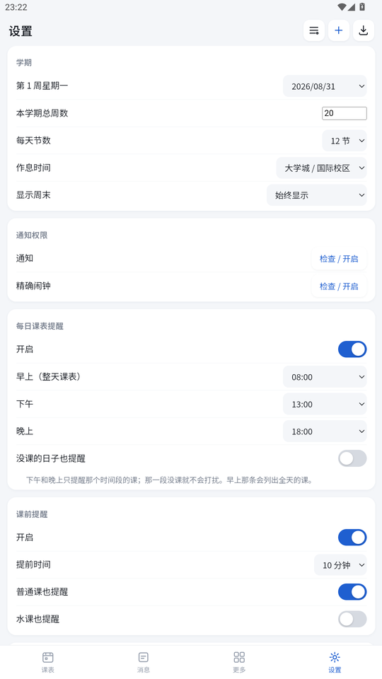

# 华工课程表

> 给华南理工大学学生写的课程表 App。周课表、上课提醒、请假 / 签到 / 备注、放假调休、PDF 导入导出，全都在一个不到 90 KB 的安装包里。
>
> **不登录任何账号，不联网（除主动使用的「网页导入」），所有数据只存在手机本机。**



---

## 目录

- [功能](#功能)
- [截图](#截图)
- [下载与安装](#下载与安装)
- [使用说明](#使用说明)
- [数据与隐私](#数据与隐私)
- [从源码构建](#从源码构建)
- [技术笔记](#技术笔记)
- [常见问题](#常见问题)
- [已知限制](#已知限制)
- [更新日志](#更新日志)
- [联系与致谢](#联系与致谢)

---

## 功能

### 课表

- **按周显示**，左右滑动或点 `‹` `›` 翻周，也可以点「回到本周」跳回来。
- **本周的课全部上完后，下次打开会自动跳到下一周**。整周没课（放假）不跳，最后一周也不再往后跳。
- 左侧时间刻度标着每一节的上课时刻，**时间贴着格子顶边**，跟课块顶端严格对齐。
- 上午 / 下午 / 晚上用一条分割线隔开；分割线落在**让出来的行距里**，不会被课块压住。
- **同一门课永远同一种颜色**，12 色色板按课程分组分配，12 门课以内颜色互不重复。颜色可以在编辑课程里自己改（改的是整门课）。
- 同一时段有两门课时自动左右分栏。
- 作息支持**大学城 / 国际校区**和**五山校区**两套预设（第 1 节分别是 08:50 和 08:00）。

### 课程管理

- 点任意课块打开详情：时间、地点、教师、校区、周次、教学班、学分、状态、标记、备注。
- **请假**：这一周的这节课变灰划线，且不再收到它的课前提醒。
- **签到**（默认关闭，可在设置里开）：课块右下角打勾；过了上课时间还没签自动打红叉。
- **标记**：把整门课标成「⭐ 重要」或「💧 水课」，提醒文案会跟着变。**标记跟着课程走**——任意一节点一次，这门课所有节次都带上。
- **备注 + 附件**：备注文字会跟着课前提醒一起发。还能加图片和文件——图片会先压缩（长边 1100px），点了全屏看；其它文件单个上限 1 MB，点击交给系统里能打开它的 App。
- 手动增删改课程，或者从 PDF 导入后微调。

### 提醒与通知

- **每日课表提醒**：默认 **08:00 / 13:00 / 18:00** 三次。
  - 早上那条列出**全天**的课；
  - 下午、晚上**只提醒那个时间段的课**，那一段没课就不会打扰。
- **课前提醒**：默认提前 **10 分钟**（5/10/15/20/30/45 可选）。
  - 正文含节次、起止时间、地点、教师、备注。
  - **备注里有图片会直接铺在通知上**（展开通知即见），文件名也会列进正文。
- 普通课和水课可以分别控制要不要发课前提醒。
- 请假、调休停课的日子不推任何提醒。
- 提醒由系统 `AlarmManager` 精确触发，**App 不需要在后台常驻**。

### 提醒事项

- 「更多」→ 提醒事项，把自己要办的事记进来（交作业、还书、取快递……）。
- 每条可以填：**事项名称**（必填）、**提醒日期**、**提醒时间**（选填）、**事项描述**（选填）、**附件**（选填，图片或文件）。
- 提醒日期支持两种：
  - **指定某一天**——只在那一天提醒；
  - **每周固定**——勾几个星期几（比如每周一三五），那几天都会提醒。
- 什么时候响：
  - **填了时间**：到那天那个时刻准时提醒，通知里带上描述和附件图片；
  - **只填了日期**：当天早上跟着课表那一条一起提醒（默认 08:00）。
- 课表上会同步标出来：只填日期的在**当天表头**点个小铃铛；填了时间的落在那个时刻——**那一刻有课就挂在那节课的块上，没课就在那一刻画一条小标**。
- 列表里点一条就能改或删。

### 调休与放假

- **点课表最上面那一格**（写着「周一 9/14」的地方，整格都是按钮，外观上看不出）就能编辑那一天：
  - **禁用当天**：那天的课块全部变灰划线（但**不会消失**，能看清哪些课被停了），当天不再有任何提醒。再点一次就是启用。
  - **调休**：把别的日子整天的课挪到这天。只能选本来没课或已禁用的日子——否则会提示先禁用。**调休不可撤销**，会先弹确认。
- **「更多」页还有更省事的做法**：填一个放假日期范围一键停课，需要的话再加若干条调休，最后点右下角「确定」一起生效。
- 调休落到周末时，课表会临时把周末两列露出来，不然挪过去的课看不见。

### 每日运势

- 「更多」→ 每日运势，**每天第一次点进去抽一次**。
- 概率：**凶 20% / 平 35% / 吉 45%**。
  - 凶 → 大凶 / 中凶 / 小凶，等概率；
  - 平 → 大平 / 中平 / 小平 各 30%，一平如洗 10%；
  - 吉 → 大吉 / 中吉 / 小吉 各 30%，剩下 10% 三等分给桃花运 / 天选之子 / 王马小吉。
- **昨天中过凶，今天一定不会再中凶**。
- 中凶时显示小字：平时「日行一善即可消灾」，**星期四改「vivo50即可消灾」**。
- 弹层里能看到今天的结果（占大头）、已连续抽运天数、最近 7 天记录，以及每种运势抽中的次数（没抽到的不显示）。超过 7 天可以展开看全部趋势。
- **中间断了一天没抽，之前的记录就清空重来。**

### 导入导出

- **导入**两条路：
  - 本地 PDF：`＋ → 导入课表 PDF`
  - **网页导入**：`＋ → 网页导入`，在 App 内打开教务系统，你自己登录、自己点「输出PDF」，App 把那份 PDF 截下来自动导入。**账号密码不经过本 App，也不会被保存。**
- **导出**：右上角 `⤓`
  - 详细课表 PDF（按教务系统的版式）
  - 本周课表 PDF（带签到 / 请假 / 备注 / 标记，停课的格子会标「停课」）
  - 两种都能直接分享出去

### 其他

- **消息中心**：当天发过的提醒都留一份，点任意一条能看到完整内容（含附件）。**第二天早上自动清掉昨天的。**
- 双击返回键退出；有弹层时返回键先关弹层。

---

## 截图

| | | |
|---|---|---|
|  |  |  |
| 周课表 | 课程详情 | 点表头编辑某一天 |
|  |  |  |
| 提醒事项 | 每日运势 | 调休（更多页） |
|  |  |  |
| 消息中心 | 更多 | 设置 |

---

## 下载与安装

1. 从 [Releases](../../releases) 或本仓库根目录拿 `华工课程表-v1.1.4.apk`，传到手机（微信 / QQ 传文件、数据线拷贝都行）。
2. 点击安装。系统提示「未知来源」时选择允许。
   **从旧版本升级直接覆盖安装即可**，数据（localStorage）不会丢。
3. 首次打开会询问通知权限，**一定要允许**，否则每日课表和课前提醒收不到。
4. 如果设置里显示「精确闹钟未授权」，点一下去系统里打开（Android 12+ 需要），否则提醒时间会有几分钟偏差。

**系统要求**：Android 8.0（API 26）及以上。

---

## 使用说明

### 导入课表

**网页导入（推荐）**：`＋ → 网页导入` → 在弹出的页面里登录教务系统 → 找到课表页面 → 点页面上的「输出PDF」→ 关掉页面，课表就自动进来了。

整个过程 App 不接触账号密码。如果解析失败，会问你要不要**把原始 PDF 存到下载目录**——把它发给开发者就能定位格式差异。

**本地 PDF**：如果你手上已经有教务系统导出的课表 PDF，直接 `＋ → 导入课表 PDF` 选文件即可。

### 通知收不到 / 不准时

按顺序检查：

1. **通知权限**：设置 → 通知 → 「检查 / 开启」。
2. **精确闹钟**：设置 → 精确闹钟 → 「检查 / 开启」（Android 12+ 必须开，否则系统会把提醒推迟）。
3. **电池优化**：把本 App 加入系统的省电白名单。国产 ROM（MIUI / ColorOS / OriginOS 等）还要额外允许「自启动」和「后台弹出界面」。
4. **提醒只预排未来 21 天**，靠「每次打开 App 重排」来滚动续期。如果超过三周不打开，后面的提醒会缺；开机和 App 更新时会自动重建。

### 调休怎么用（以国庆为例）

假设 10 月 1–7 日放假、9 月 27 日（周日）补 10 月 6 日（周二）的课：

1. 「更多」→ 调休
2. 放假：从 `2026/10/01` 到 `2026/10/07`（＝这七天停课）
3. 调休：点「＋」→ 原上课日选 `2026/10/06`，调到哪天选 `2026/09/27` → 添加
4. 点右下角 **确定**

结果：9 月 27 日上周二的课，10 月 6 日停课。**调休不可撤销。**

---

## 数据与隐私

- **所有数据只存在手机本机的 `localStorage` 里**，没有服务器，没有账号体系。
- App 只申请了 `INTERNET` 和 `POST_NOTIFICATIONS` 两个权限。`INTERNET` 仅用于「网页导入」时访问教务系统。
- **不做账号密码自动登录**。网页导入是让 WebView 走真实登录流程，App 只在本地截获那份 PDF。
- 卸载 App 即删除全部数据。升级覆盖安装不会丢。
- 设置页可以一键清空全部课程与设置。

<details>
<summary>数据长什么样（localStorage 里的一个 key：<code>scut_kcb_db_v1</code>）</summary>

```jsonc
{
  "meta":   { "student": "…", "sid": "…", "firstWeekMonday": "2026-08-31" },
  "entries": [ /* 课程条目：名字/代码/教师/地点/星期/节次/周次/学分/标记 */ ],
  "marks":  { "<条目id>@<周次>": { "leave": true, "sign": true, "note": "…", "files": [...] } },
  "colors": { "<课程代码>": 3 },          // 自定义配色，跟着课程走
  "days":   { "2026-10-01": { "off": true },
              "2026-09-27": { "from": "2026-10-06" } },   // 放假 / 调休
  "fortune":{ "log": { "2026-09-16": "大吉" } },
  "msgs":   { /* 消息中心 */ },
  "settings": { "dailyTimes": ["08:00","13:00","18:00"], "preMin": 10, /* … */ }
}
```

</details>

---

## 从源码构建

### 环境依赖

- **JDK 17**
- **Android SDK**：`build-tools;34.0.0` + `platforms;android-34`
- Python 3（构建脚本里用来净化资源）
- 不需要 Gradle，不需要 Android Studio，不需要 AndroidX

### 构建

```bash
bash tools/build.sh
# 产物：build/huagong-schedule.apk
```

脚本里写死了 JDK 和 SDK 的路径，换机器改 `tools/build.sh` 顶部的 `JAVA_HOME` 和 `SDK` 即可。

构建流程就是手写的一串工具调用：

```
aapt2 compile 资源
aapt2 link    → base.apk + R.java
javac         编译 Java 源码
d8            → classes.dex
zip           打进 base.apk
zipalign      4 字节对齐
apksigner     签名（复用 tools/keystore.jks）
```

### 工程结构

```
app/
  AndroidManifest.xml
  res/                          图标、主题、network_security_config
  src/com/scut/kcb/
    MainActivity.java           通知排程 / 文件选择 / 离线渲染 PDF / 网页导入的 WebView
    ReminderReceiver.java       AlarmManager 到点弹通知（含备注图片大图）
    BootReceiver.java           重启 / 更新后恢复全部提醒
    PdfProvider.java            把 cacheDir 里的文件暴露成 content:// 供分享和外部打开
  assets/
    www/                        主界面：index.html + app.css + app.js + kbpdf.js
    capture-hook.js             注入到教务系统页面的探针
tools/
  build.sh                      一键出包
  test-logic.js                 纯逻辑测试（假 DOM + 可控时间）
  test-pdf.js                   用真实课表 PDF 验证解析器
  diag-plan.js                  dump 通知计划，查重复 / 内容错位
  make-seed.js / seed-static.js 生成界面预览用的演示数据
  pack-source.py                打包源码 zip
  keystore.jks                  签名密钥
```

### 工具脚本

| 脚本 | 用途 |
|---|---|
| `node tools/test-logic.js` | **纯逻辑测试，177 项**。给 app.js 一个假 DOM 和一个可控的「现在」，直接测日期计算、配色分配、通知计划、调休、运势概率这些 |
| `node tools/diag-plan.js` | 把通知计划 dump 出来，查「同一时刻重复」「老师地点对不上本周」 |
| `node tools/test-pdf.js` | 用真实课表 PDF 验证解析器，打印全部解析结果 |
| `node tools/dbg-head.js` | 打印 PDF 表头区域的文字坐标（调解析器时用） |
| `node tools/make-seed.js` | 生成演示数据，用于在浏览器里预览界面 |
| `python tools/bump-version.py 1.1.2` | **一键改版本号**：清单、`build.sh`、`app.js`、`index.html`、README 里的版本号一次改完。重复执行不会出错 |
| `python tools/pack-source.py xxx.zip` | 打包源码 zip（顺手净化被预览工具注入的属性，并剔掉 `_` 开头的本地预览页） |

**在浏览器里预览界面的方法**：起 `python -m http.server` 指向 `app/assets/www`，
在页面控制台执行 `tools/seed-eval.js` 的内容注入数据，刷新即可。
调试时 `HG.printHtml('raw'|'week')` 能拿到要打印的 HTML，方便单独看排版。

> `tools/build.sh` 会先把 `app/assets` 复制成 `build/assets-clean` 再打包，
> 并在复制过程中清掉 `data-page-node-id` 之类的注入属性（桌面端 HTML 预览工具会持续回写这些属性），
> 同时剔除 `_` 开头的本地预览页。

---

## 技术笔记

### 为什么不用 Gradle / AndroidX

这个 App 的界面和业务逻辑**全部放在 `assets/www` 里**（HTML + CSS + 原生 JS），原生层只做 JS 做不到的事：通知排程、文件选择、离线渲染 PDF、网页导入的 WebView。

这样做的直接好处：

- 改界面不用碰 Java，加功能基本只加 HTML/JS；
- 不需要 AndroidX，因此也不需要 Gradle —— 整个构建就是 `aapt2 + javac + d8 + zipalign + apksigner` 五步手写脚本，**5 秒出包**；
- 安装包只有 **~90 KB**；
- 界面可以直接在浏览器里跑，配合假 DOM 还能在 Node 里跑逻辑测试。

代价是分享 / 打开文件时没有 `FileProvider`，所以自己写了个 20 行的 `PdfProvider`（只读、`exported=false`、靠 `grantUriPermissions` 临时授权）。

### PDF 解析原理（`app/assets/www/kbpdf.js`）

教务系统导出的课表 PDF 由 iText 生成，字体是 `STSong-Light` + `UniGB-UCS2-H`，
**字符串字节本身就是 UTF-16BE**，所以不需要字体映射表就能还原中文。解析步骤：

1. 解析 PDF 对象，找到 `/Type/Pages` → `/Kids` 得到页面顺序，取每页 `/Contents`；
2. 解 FlateDecode（优先用浏览器原生 `DecompressionStream`，失败退回纯 JS inflate）；
3. 扫 `BT..ET` 里的 `Tm`/`Tj`，拿到「坐标 + 文本」；
4. 用表头「星期一..星期日」的 x 坐标定出 7 个日列（只出现在首页），逐页剔除表头行；
5. 按页序、列内按 y 从大到小把该列文本拼起来（**单元格会跨页，必须拼完再解析**）；
6. 用 `(N-M节)` 切段，段间以 `学分:x` 为界，段前的残留就是下一门课的课名。

### 网页导入是怎么工作的

核心结论：**不要做账号密码自动登录**（CAS 密码是前端 RSA 加密的，还有可随时打开的智能验证码），
而是让 WebView 走真实登录流程，然后就地截获。

- 登录态：把 WebView 的 `CookieManager` 当作唯一来源，`HttpURLConnection` 请求时直接用 `CookieManager.getCookie(url)` 带上，不手工搬 `JSESSIONID`。
- 三条截获路径，都要有：① `shouldInterceptRequest`（只探测 GET，**POST 重放可能有副作用**）② `DownloadListener` 兜底 ③ 注入 `assets/capture-hook.js` 钩住 `fetch` / `XHR` / `window.open` / `form.submit` / `URL.createObjectURL`。
- **唯一判据是响应体以 `%PDF-` 开头**，不信 `Content-Type`（正方系统有时返回 `application/octet-stream` 甚至套一层 JSON）。
- 明文 http 的放行靠 `res/xml/network_security_config.xml`，**不配这个 WebView 会白屏**。
- 踩过最深的坑：**「输出PDF」是 POST 请求，不能用 GET 重放**。

### 消息中心是怎么工作的

不在原生侧记日志，而是**在 JS 里「预告」**：每次生成提醒计划（未来 21 天）时，把计划也写进 `DB.msgs`，key 与提醒的 key 一致。这样重复生成不会重复、也不会把读过的重新标成未读；`at <= now` 的消息才显示出来，因此到点自动出现，不需要 App 在后台跑。

**key 里不能带序号**（比如"当天第几节课"）——课表一增删序号整体位移，key 就变了，消息中心会攒出一堆看不出区别的重复记录。key 只由内容决定，例如 `p<日期>_<条目id>`。

### 测试

`tools/test-logic.js` 给 `app.js` 一个**假 DOM** 和一个**可控的「现在」**，然后把源码 eval 一遍，在 IIFE 收尾前塞一个出口把内部函数暴露出来（源文件不用改）。因为界面代码是 `$('kbBlocks').innerHTML = blocks` 这种写法，把假元素**按 id 缓存**之后，渲染出来的 HTML 也能读回来断言。

覆盖范围（177 项）：

- 日期与周次计算、自动跳周的各种边界（周一早上 / 周五下课前后 / 假期周 / 最后一周 / 学期结束）
- 配色分配与自定义覆盖、标记的整课传播
- 通知计划：不重复、内容与本周一致、每日提醒的三段归属、附件图片去重
- 单日禁课 / 调休 / 一键停课范围 / 周末可见性
- 运势的**概率分界**（把 `Math.random` 换成预设序列精确打点）+ 4000 次总量统计 + 断签清空
- 消息中心的当日清理与去重
- 课表画布被某些 WebView 压塌时的兜底（量出宽度不对就补像素宽度）
- 消息中心：删掉的条目在计划里消失后，它那条还没到点的记录要跟着清掉（已响过的保留）
- 提醒事项：两种日期模式的命中、到点时间、按周重复的排期次数、附件与通知大图、停课日照发，以及课表上三种标记各自出现在哪里

概率类的需求，光跑大数统计验证不了边界，得两者结合。

---

## 常见问题

**Q：课表上的日期 / 周次对不上怎么办？**
设置 → 「第 1 周星期一」。所有提醒日期都跟着它走。默认 `2026-08-31`，依据是学校《关于认真做好本科生 2026-2027 学年第一学期排课工作的通知》：该学期自 2026-08-31 起共 20 周，2026 级教学周为 3–16 周。

**Q：换学期了要改什么？**
设置里把「第 1 周星期一」和「本学期总周数」一起改，然后重新导入课表。

**Q：周课表上能不能直接看到某天被停课了？**
能看到——那天所有课块会变灰划线，但不会消失，这样你能确认哪些课被停了。

**Q：调休弄错了能撤销吗？**
不能。所以应用前会让你确认一次。不过「禁用某一天」是可以随时开关的。

**Q：为什么周课表突然多出周六周日两列？**
因为那周有调休把课挪到了周末。临时露出来，不然挪过去的课看不见。

**Q：每日运势断了一天会怎样？**
之前的记录全部清空，连续天数从 1 重新开始。

**Q：App 会不会偷偷上传我的数据？**
不会。没有服务器，没有账号，除了你自己点「网页导入」时访问教务系统之外不产生任何网络请求。不放心的话可以断网用，除了网页导入之外一切正常。

---

## 已知限制

- 同一个格子有两门课重叠时会自动左右分栏，窄屏上课名会换行换得很碎。
- 提醒只预排未来 21 天，靠「每次打开 App 重排」来滚动续期；超过三周不打开，后面的提醒会缺。开机和 App 更新时会自动重建。
- 每日 / 课前提醒都按「整天」预排，跨天时依赖 App 被打开一次来校正。
- **非图片附件没法附在系统通知上**（Android 通知不支持携带任意文件），只能把文件名列进通知正文，要打开得进 App。
- 每日运势的随机源是 `Math.random`，纯娱乐，别当真。

---

## 更新日志

### v1.1.4

- **修一个只在个别机型上出现的渲染 bug：整个课表的课块会挤成左边一条竖线。**
  （有人在荣耀某机型上遇到，截图里 7 天的课全叠在一列里、网格线也没了。）

  原因是 `.kb-body` 这层同时用了 **flex 行 + 纵向滚动**：
  `.kb-times`（固定 50px）+ `.kb-canvas`（`flex: 1`）。某些 WebView 会把
  那个 flex 子项算成 0 宽 —— 而课块和网格线都挂在这个容器上，容器一塌，
  里面的 `calc(20% - 2px)` 就变成负数、退回 `auto`，于是课块缩成一个字的宽度。

  **改成完全不用 flex 的块级布局**：滚动容器 + 左侧时间列绝对定位 + 画布 `margin-left` 让位。
  高度本来就在 JS 里按节数算好写进去，所以块级元素也有确定尺寸。

- **再加一道兜底**：渲染完量一下画布宽度，如果明显小于「容器宽 − 时间列宽」，
  就直接写死一个像素宽度。**这道兜底在模拟器上验证过** —— 把画布强行压成 20px
  模拟塌陷，界面被完整救回来了（7 列、课块位置全对）。所以就算上面那处结构性修复
  没覆盖到某个内核的真实原因，界面也能自己恢复。

- 顺手把 5 处 `inset: 0`（简写，Chrome 87+）换成 `top/right/bottom/left` 分开写。
  虽然从遮罩的显示看这个内核是支持的，但换掉零成本。

### v1.1.3

- **修一个真 bug：提醒事项删掉之后，它在消息中心的那条记录不会跟着消失。**
  `syncMsgs` 一直只管往消息中心加、以及清「昨天以前的」，**从来没清过
  「还没到点、但计划里已经没有」的条目**。所以把一条未来的提醒删掉，
  那条记录会一直挂在消息中心（还写着「点开看全文」），看着就像真发过一样。
  现在这类记录会跟着清掉；**已经响过的历史仍然保留**。
- **删除提醒事项时立刻重排闹钟**，不再等那 400ms 的合并窗口 ——
  否则用户在这段时间里把 App 划掉，被删那条的闹钟还挂在系统里，到点照样响。
  顺手把 `scheduleAll()` 拆成 `scheduleAll(now)` + `runSchedule()`，
  需要立即生效的传 `true`。

### v1.1.2

- **设置页底部再加一排「作者 QQ：2013549019」**（纯展示，点了没反应，所以压平了样式，免得看着像能点）。
- **把 `tools/bump-version.py` 重写成能用的工具**。原来是 v1.0.9 时代写死的一次性脚本
  （只会把 `versionCode` 从 8 改成 9，其它什么都不管），留着迟早坑人。
  现在 `python tools/bump-version.py 1.1.2` 会一次改完五处版本号
  （清单 / `build.sh` / `app.js` / `index.html` / README），
  改完还会复核清单；重复执行、参数写错都只会被挡住，不会改坏东西。

### v1.1.1（提醒事项）

1. **「更多」新增「提醒事项」**（`DB.todos`）。
   - 字段：名称（必填）、提醒日期、时间（选填）、描述（选填）、附件（选填）。
   - 日期两种模式：**指定某一天**，或**每周固定**勾几个星期几。
   - 到点规则：填了时间就按点发；只填日期就跟着**当天早上那条课表提醒**一起发（默认 08:00）。
   - 提醒事项**和课程无关**——整天停课的日子也照发。
   - 通知会带上描述和附件：图片走 `BigPictureStyle` 铺成大图，文件名列进正文。
   - 复用备注那套附件逻辑：把附件区抽成了 `attCtx / attEditorHtml / attClick`，
     备注和提醒事项共用，没有写两份。

2. **课表上的同步标记**。三种情况对应三种画法：
   - 只填日期 → **当天表头右上角**一个小铃铛（表头本来就整格是隐形按钮，不加结构）；
   - 填了时间而且**那一刻没课** → 在那个时刻画一条黄色小标，
     位置由 `yFor(hhmm)` 把时刻换算成 y（落在课间时贴着上一节底边）；
   - 填了时间而且**那一刻有课** → 不另外画，直接在**那节课块上挂一个 🔔**。

3. **大学城作息默认改成 12 节**。`periods` 默认值 11 → 12；
   老数据里如果还是 11、且作息是大学城，`load()` 会补成 12
   （只在"还是旧默认值"时才动，不会覆盖你自己改过的值）。

4. **顺手修了系统弹窗的标题**。WebView 默认的 `confirm` 标题是
   `网址为"file://"的网页显示：`，很不像人话。现在重写 `onJsConfirm` / `onJsAlert`，
   标题统一成「华工课程表」，按钮是标准的「取消 / 确定」。

### v1.1.0（每日运势 / 设置页联系方式）

1. **更多页新增「每日运势」**。每天第一次点进去抽一次，同一天再点只显示结果。
   - 先定级别再细分：**凶 20% / 平 35% / 吉 45%**。
     - 凶 → 大凶/中凶/小凶 等概率；
     - 平 → 大平/中平/小平 各 30%，一平如洗 10%；
     - 吉 → 大吉/中吉/小吉 各 30%，剩下 10% 三等分给桃花运 / 天选之子 / 王马小吉。
   - **昨天中过凶，今天一定不出凶**：这时把平、吉按 35:45 重新归一
     （界落在 `35/80 = 0.4375`，测试里专门验了这个边界）。
   - 中凶时显示小字：平时「日行一善即可消灾」，**星期四改「vivo50即可消灾」**。
   - 弹层里：今天的运势占大头（44px + 按级别配色：凶灰 / 平蓝 / 吉金）、
     已连续抽运天数、最近 7 天记录、以及**各运势抽中次数（没抽到的不显示）**。
     超过 7 天会出现「查看全部趋势」按钮，切过去列出全部天数。
   - **断一天就重来**：`drawFortune` 里先看昨天有没有记录，没有就把 `log` 整个清空。
     连续天数是从今天往回数出来的（今天没抽就先从昨天起算），不额外存字段。

2. **设置页底部加了三排联系方式**：项目 GitHub、作者邮箱、资源网盘。
   每排都是一个按钮，点了交给系统浏览器 / 邮件 App —— 新增原生桥 `openUrl(url)`
   （不拦截的话 WebView 会在自己里面跳走，把整个界面顶掉）。

3. 顺手给 `.more-list` 加了 `gap`，两个功能卡片不再贴在一起。

### v1.0.9（通知带附件 / 每日提醒分段 / 消息详情 / 调休改版）

1. **课前通知带上备注的图片和文件**。
   - 添加图片附件时顺手多压一张 **640px 的小图**（`f.tn`），专门给通知大图用，
     不会把整张原图塞进提醒计划。
   - `buildPlan` 给这类提醒挂一个 `img` **key**，图片本体放在另一个 map 里
     （模块级 `planImgs`），**同一张图只存一份**——否则一门课 21 天里出现 6 次，
     计划里就会塞 6 份 base64。
   - 原生 `schedule(json, imgs)` 收两个参数；只保留本次计划真正用到的图，
     存进 SharedPreferences 的 `alarmImgs`；闹钟到点时 `ReminderReceiver` 才解码，
     `Notification.BigPictureStyle` 展开就是那张图。
   - 文件名会列进通知正文（`📎 报告模板.png、讲义.pdf`）。
     **Android 通知本身没法携带任意文件**，只能显示图片 + 列名字。
   - 踩坑：`BigPictureStyle` **没有 `bigText()`**（那是 `BigTextStyle` 的），
     正文只能走 `setContentText`，编译期才发现。

2. **每日课表提醒拆成早/午/晚三段**（默认 08:00 / 13:00 / 18:00）。
   - 早上那条照旧列**全天**；下午、晚上各自只列 `sectionOf(p)` 属于本段的课，
     **那一段没课就直接不提醒**（不是发一条"没课"）。
   - 老数据只有两条时间，`load()` 里补一条迁移到三条。
   - 顺带满足「每天早上清理昨天的信息」：`syncMsgs` 的保留期从 40 天改成
     **今天 0 点**，消息中心只剩当天的。

3. **消息中心可点开看全文**。每条加上 `data-msg`（计划 key），点开弹层显示
   标题 / 完整时间 / 全文；如果这条是某节课的提醒，还会把它那次的**附件**列出来并能点开。
   `pastMsgs()` 现在带出 key（浅拷贝，不写回存储）。

4. **更多页「调休」交互重做**：
   - 放假只留两个日期框 + 一行说明「放假期间的课程表会被禁用」，**去掉了那个按钮**；
   - 调休区**初始只有一个「＋」**，点开才出现两个日期框和「添加这一条」，加完自动收回；
   - **所有改动都进草稿，点右下角「确定」才一起生效**（之前是各自立即生效）。
     重绘前会先把日期框的值捞回 `swapTool`，不然一重绘就白填。

5. **修一处没做到位的地方**：当天有课时「调休」虽然点了会提示，但**看不出来是禁用的**。
   给 `.act` 加了 `.off`（`opacity: .4`），现在有课的日子那个按钮是明显灰的，
   禁用当天后立刻亮起。

### v1.0.8（单日禁课 / 调休）

**数据模型**：新增 `DB.days`，按**具体日期**记两件事，和课程条目完全分开存：

```js
DB.days['2026-10-01'] = { off: true }            // 这天停课
DB.days['2026-09-27'] = { from: '2026-10-06' }   // 这天上周二(10-06)的课
```

两个标记可以并存，此时 `off` 优先。核心是三个函数：
`rawCourses(date)`（那天的原始课表）、`dayCourses(date)`（算上禁用/调休后真正要上的）、
`canSwap(date)`（这天能不能调休）。

1. **表头就是按钮**。`周一/周二…` 每一格加了 `data-date` 和点击处理，
   点一下打开当天编辑。**没有多出任何元素，外观和以前一模一样**——
   测试里直接比对渲染出来的 HTML：还是 1 个 spacer + 5 个 `.kb-daycell`，没有 `<button>`。
2. **禁用当天**：当天课块全部套上 `leave` 样式（变灰 + 划线 + ⊘），
   但**不会消失**——这样你能看见哪些课被停了。同时 `buildPlan` 直接跳过这天，
   课表提醒和课前提醒都不会发。再点一次就是启用。
3. **调休**：只有「当天本来没课」或「已禁用」时按钮才亮，否则提示要先禁用。
   选一个本学期内的日期，那天整天的课会挪到当前这天：
   `applySwap(src, dst)` 给 `dst` 打 `from = src`，同时把 `src` 标成 `off`。
   调休会先弹确认，之后不可撤销。
   **副作用**：调休落到周末时，`visibleDays()` 会临时把周末两列露出来，
   否则挪过去的课根本看不见。
4. **更多页**：第一块功能「调休」。一个弹层里两件事：
   放假日期范围一键停课；调休可以加多条（选原上课日 + 调到哪天），最后一次应用。
5. 连带同步的地方：`autoWeek`（整周停课就不再往后跳周）、
   周课表 PDF（停课的格子标「停课」）、详情弹层的签到时间
   （按「这一节显示在第几列」算，调休后不会算错日期）。

> 这一版把 `renderKb` 的渲染单位从「课程条目」改成了「列 → 当天的课」，
> `assignLanes` 也跟着按列分组，key 是 `条目id@列` —— 因为调休后同一节课
> 可能同时出现在两列上（原地灰块 + 新日期正常块）。

### v1.0.7.1（补丁）

1. **删掉课表上的蓝色「当前时间线」**。就是那条横穿课表、随当前时间上下移动的蓝线
   （`#kbNow` / `.kb-nowline`）。元素、样式、渲染代码三处一起删干净，没有残留。
   今天的日期高亮不受影响。

2. **通知可能重复/内容不对的几处加固**。
   先说结论：**逐条验证下来，通知计划的生成本身是干净的**——
   用真实课表跑了 21 天共 81 条计划，同一时刻+同一内容重复 0 条，
   每条提醒里的老师和地点都与"本周真正要上的那一节"一致。
   原生的 PendingIntent 也是按 `action + id.hashCode()` 唯一构造的，没有覆盖串号。
   但确实存在几条**能导致重复的现实路径**，都堵掉了：

   - **计划 key 里带的课程序号去掉了**（原来是 `p日期_序号_条目id`，现在是 `p日期_条目id`）。
     序号会随着课表增删而整体位移，一移位 key 就变 —— 旧提醒取消、新提醒重建，
     但**消息中心里旧的那条不会消失**（只按 40 天老化），于是攒出一堆看不出区别的"重复"消息。
   - **同一天里同门课的重复条目会被合并**（按 名字+节次+地点+老师 去重）。
     万一课表被导入过两遍留下重复条目，以前会推两条一模一样的提醒。
   - **消息中心新增去重**：同一时刻、同一内容的历史消息合并成一条，只要有一条没读过就仍算未读。
   - 计划范围从写死的 `w > 30` 改成 `w > totalWeeks()`，不再为学期结束后的日子排提醒。

### v1.0.7（课表时间刻度重做）

只动了主页课表的左边一列和网格线，其余逻辑一行没碰。

1. **上午 / 下午 / 晚上加分割线**。分割点不是写死的，而是按作息表算：
   用 `sectionOf(p)` 把每一节按开始时间归到三段（< 12:00 上午、< 18:00 下午、其余晚上），
   相邻两节不在同一段就在中间切一刀。所以换作息（大学城 / 五山）、改总节数都会自动跟着变。

2. **分割线处让出额外行距**。原来课块从节次的顶边开始铺，而分割线也画在同一个 y 上，
   结果**课块把线盖住了**（`.kb-blocks` 在 `.kb-gridlines` 之后，后画的在上）。
   现在分段处多留 `--sec-gap: 20px`，行位置不再等距：
   `tops[p]`（第 p 节的顶边）由 JS 逐节累加算出，分割线落在让出来的空隙正中，两边都不挨着课块。
   - 课块的 `top` 用 `tops[e.s]`，`height` 用 `tops[e.e] + 54 - tops[e.s] - 3` ——
     跨分段的长课块会把中间让出的行距一起算进去，不会变矮。
   - 时间轴上的「现在线」同样改用 `tops[i]`，跟着新的行距走。

3. **分割线加粗**：1px → **2px**，颜色 `#ADB9C8`（普通网格线是 `#E7EAEF`）。

4. **段落名换位置**：从「分割线上方」挪到**让出的那一行里、和分割线同一水平线**，
   右对齐在时间列内。视觉上就是 `下午 ────────────────` 这样一条带标题的分隔线。

5. **时间刻度的主次对调**：
   - 节次（1、2、…、11）**加大加黑**：10px / `#AEB6C2` → **12px / `#414B59`**。
   - 时间（08:50 之类）**缩小变灰**：11px / `#6C7482` → **10px / `#A6AEBB`**。
   - 两者仍是同一行、贴格子顶边（格子顶边 = 这节课的开始时刻），整体右对齐成一列。

6. **修「标记」点了没反应**。这是个存在很久的事件顺序 bug：
   `bind()` 里用 `addEventListener` 注册了一个委托监听器（先注册），
   各弹层又用 `element.onclick = fn` 换自己的处理器（后注册，但在同一个元素上）。
   DOM 规定**委托监听器先跑**，所以点详情里的「标记」时：
   委托先跑 → `openTagPicker` 换掉内容、并把 `onclick` 改成选择器的处理器；
   紧接着那个 `onclick` 槽位就带着**新的**处理器又跑了一次，
   而 `ev.target` 已经是被换掉的旧按钮 → `b.dataset.tag` 是 `undefined` → 标记被写成了空值。
   修法两处：委托监听器只认 `.act[data-act]`（选择器里的是 `data-tag`），
   以及选择器自己的处理器加一道 `$('sheetBody').contains(b)` 守卫。
7. **标记也改成跟着课程走**：新增 `setCourseTag(e, tag)`，同一门课的所有节次一起打。
   编辑课程表单里改标记同样会传播。这样「标一次，以后所有该课都带上」。
8. **分割线压在纵向表格线之上**（`z-index: 1`），交叉处不会被浅色竖线切出缺口。
9. **「回到本周」不再压住日期行**。原来它 `position: absolute; bottom: -2px`，
   正好落在日期那一行上。现在周导航栏底部固定留出 36px，按钮放在日期下方的独立一行：
   显示/隐藏都不改变高度，翻周时不会跳。


> 判断段落的 `sectionOf()` 是纯函数，已经加进 `tools/test-logic.js` 的覆盖范围里
> （`node tools/test-logic.js` 一把跑完 177 项）。

### v1.0.6

1. **本周课上完自动跳到下一周**。打开 App 时先算「本周最晚一节课的结束时间」，
   已经过了就显示下一周。整周没课（假期）不跳，免得一路往后跑；最后一周也不再往后跳。
   「回到本周」按钮用的是同一套判断。
2. **课前提醒默认改成 10 分钟**（原来是 20）。只影响全新安装。
3. **同一门课固定同一种颜色，并且可以自己改**。
   - 色板从 8 色扩到 12 色，按课程分组的顺序以步长 5 分配（5 与 12 互质），
     所以 **12 门课以内颜色互不重复**。同一门课不管排在哪天、哪几节，颜色都一样。
   - 编辑课程时选颜色改的是**整门课**（存进 `DB.colors`，键是课程代码，没有代码就用课程名）。
   - 旧数据里逐条存的 `entry.color` 会被忽略，颜色自动重算，不用手动迁移。
4. **备注可以加图片和文件**。
   - 图片先用 canvas 缩到 1100px 再压成 JPEG（质量 0.72），一般几十到一百多 KB；
     点开是 App 内全屏预览。其它文件单个上限 1 MB，点击交给系统里能打开它的 App。
   - 数据跟着「这一周的这节课」走，和备注文字同一个 `mark`（`files` 数组），
     所以课前提醒里发文字、课块上多一个 📎 标记。
   - 原生侧新增 `openFile()` 桥：把附件写进缓存目录，再用 `PdfProvider` 暴露成
     `content://` 交给系统（`getType` 现在会读 `type` 参数，之前写死 application/pdf）。
   - 选择文件时原生会把超过 6 MB 的直接挡掉，避免一次性读进内存把 App 撑爆。

> 这一版同时加了个能在 Node 里跑的逻辑测试台 `tools/test-logic.js`：
> 给 app.js 一个假 DOM 和一个可控的「现在」，直接测 `autoWeek` / 配色分配 / 标记判空这些纯逻辑。
> **`node tools/test-logic.js`** 一把跑完。

### v1.0.5（GET 重放改成 POST 重放 + 诊断细化）

真机反馈：状态栏显示「抓到的不是 PDF」。这说明**链路已经通了**（能登录、能拦截、能发请求），
问题在抓回来的东西不对。基本可以断定：**PDF 是 POST 返回的，而原生用 GET 重放了一遍**，
自然拿到一个错误页。

1. **JS 侧直接截走响应字节（主要修复）**。钩子现在会检查 XHR / fetch 的响应，
   只要是 PDF 就自己把二进制读出来（`Blob` / `ArrayBuffer`）交给原生，
   **不再依赖重放**。响应类型读不到二进制时（`responseType` 是 text），
   才退回重放路径。
2. **重放改成带上原始的 method + body**。新增 `KcbBridge.onPdfUrl(url, method, body, contentType)`，
   原生按同样的 POST 重放。原来只会 GET，这就是「抓到不是 PDF」的直接原因。
3. **`replayFetch` 后台线程执行**，不再阻塞。
4. **诊断细化**：重放失败会打印**响应的 Content-Type 和开头 20 个字符**，
   例如 `✗ 重放回来的不是 PDF：text/html 开头「<!DOCTYPE html><html…」`，
   一眼就能看出拿到的是错误页还是登录页。URL 也只打印 `/jwglxt` 之后的部分，方便读。

> 小插曲：加这段时批量替换脚本把 `js()` 方法一起切掉了，构建报了 11 个「找不到符号」，
> 已经补回。教训：**用脚本按区间替换 Java 方法时，别用「从 A 到 B」这种宽松边界**。

### v1.0.4（修「点输出PDF 直接闪退」）

真机反馈：点「输出PDF」直接闪退。定位到三个问题，全部是 v1.0.2 埋下的：

1. **把 PDF 字节当成 `WebResourceResponse` 回给了 WebView（崩溃主因）**。
   Android WebView 不会渲染 PDF，主框架拿到 `application/pdf` 会走系统下载逻辑，
   实测直接崩。现在改成：主框架返回一个自制的「已抓到课表 PDF」结果页，
   子请求直接返回 `null`——**再也不把 PDF 字节喂回 WebView**。
2. **在后台线程调用了 WebView 的方法**。`shouldInterceptRequest` 和
   `DownloadListener` 的回调线程不一定是 UI 线程，而里面调了
   `webImp.getSettings().getUserAgentString()`。WebView 的所有方法都必须在 UI 线程上，
   否则抛「A WebView method was called on thread …」。改成创建时缓存一份 UA 字符串。
3. **`DownloadListener` 里同步发网络请求**。`onDownloadStart` 是在主线程回调的，
   同步 `HttpURLConnection` 会抛 `NetworkOnMainThreadException`。改成丢到后台线程。

另外撤掉了 v1.0.3 新加的 `setSupportMultipleWindows(true)` + `onCreateWindow`
（让新窗口复用同一个 WebView 这个写法风险偏高）。改用更安全的做法：
在注入脚本里把 `window.open` 重写成"在本页打开"，并把 `target="_blank"` 的链接改成 `_self`，
照样能让「输出PDF」的请求经过 `shouldInterceptRequest`。

**新增全局崩溃捕获**：未捕获异常会把栈写进文件，下次启动时 App 里直接弹出来，
可以一键存到「下载」目录。以后闪退都有据可查，不用再靠猜。

### v1.0.3（网页导入抢修）

网页导入在真机上失败了。按最可能的三个原因逐一排查并修掉，同时加了自诊断能力：

1. **`window.open` 被吞掉**（最可能的根因）。正方的「输出PDF / 打印」很多走
   `window.open` 或 `target=_blank`，而 WebView 默认 `setSupportMultipleWindows(false)`
   时这类弹窗**什么都不发生**——表现就是"点了没反应"。
   现在改成 `true` + `onCreateWindow` 让新窗口复用同一个 WebView，这样才拦得到。
2. **`shouldInterceptRequest` 覆盖面太窄**。原来只有命中关键词的子请求才探测，
   现在**主框架导航一律探测**（输出PDF 常见形态），并排除静态资源避免白跑。
   关键词也放宽了（补上 download / jsdy / kbdy 等）。
3. **少了 JS 钩子那条兜底**。参考实现里 `onNet` 发现 PDF 响应会补抓一次，
   我上一版只打了日志没做事——已补回（这条能覆盖 POST 返回 PDF 的情况，
   而 `shouldInterceptRequest` 只探 GET，本来就拦不到）。
4. **修掉一个潜在崩溃**：原来在 `shouldInterceptRequest` 的回调栈里直接
   `closeWebImport()` 销毁 WebView，属于重入风险；现在延后 600ms 再关，
   并加了 3 秒去重（三条截获路径可能同时命中）。
5. **加了自诊断**：
   - 导入界面底部多了一条**实时状态栏**，显示"已进入教务系统 / 打开了新窗口 /
     截获成功 N 字节 / 探测失败"等信息——**失败时截图就能定位**。
   - 解析不出课程时，会问你要不要把**原始 PDF 存到「下载/华工课程表」**，
     存下来发给开发者就能定位格式差异。
   - Logcat 里过滤 `KcbWebImport` 能看到每一次网络请求的真实地址和方法。

### v1.0.2

1. 新增**消息中心**（底部导航第二项）。所有发出去的提醒（每日课表 + 课前提醒）都会在这里
   留一份记录，有未读时底部图标显示红点。消息在"到点"之后才出现，按天分组。
2. 新增**网页导入**：在 App 内打开教务系统课表页，你自己登录、自己点页面上的「输出PDF」，
   App 把那份 PDF 截下来直接导入。**不碰账号密码，也不保存密码**。原理是把 WebView 的
   CookieManager 当唯一登录态来源，用 `shouldInterceptRequest` + JS 钩子三路截获，
   判据是响应体以 `%PDF-` 开头。
3. 课表主页支持**左右滑动换周**（左滑下一周、右滑上一周），纵向滚动不会误触发。
4. 所有弹层支持**下拉收起**：拖顶部把手往下拉，或者内容区滚到顶后继续下拉。
   顺带修了一个老 bug——遮罩层之前根本没显示过，所以点空白处关不掉、背景也没压暗。
5. 设置里新增**帮助**，13 条功能说明。
6. 设置底部加上开发者署名（按你给的原文）。
7. 删掉手动导入/导出 JSON 备份的按钮。

### v1.0.1

1. 原来右上角的「⋯」拆成两个：**＋**（导入课表 PDF / 手动添加课程）和 **⤓**（导出）。
   导出菜单里多了「分享详细课表 / 分享本周课表」，渲染完直接调起系统分享面板，不落盘。
   导出数据备份、重排提醒移出快捷栏，只留在「设置」里。
2. 「更多」页清空成功能区占位，不再摆具体项目。
3. 「原始表」从底部导航移到右上角快捷栏（☰），进入后标题变「详细原始课表」并出现返回箭头。
4. 设置里「签到标记」默认改为**关闭**。
5. 设置里新增「本学期总周数」（默认 20），周次选择器和周导航都跟着它走。
6. 删掉「今日」界面和对应导航项；**每日课表通知功能保留不变**。

底部导航现在是四项：**课表 / 消息 / 更多 / 设置**。

### v1.0.0

首个版本。

---

## 联系与致谢

- **项目地址**：<https://github.com/onsin77/SCUT_ClassSchedule>
- **作者邮箱**（欢迎发信提建议）：`K107758701@outlook.com` / `2013549019@qq.com`
- **作者 QQ**：2013549019
- **资源网盘**：<https://pan.baidu.com/s/5EtI8ggcQPDzgQuCCxEpaYw>

本软件由 2026 级 AI 先进技术拔尖 5 班 wzk 开发，感谢您对本项目的贡献！

---

## 授权

个人学习与自用项目。课表数据归华南理工大学教务系统所有，本 App 只做本地展示与提醒。
